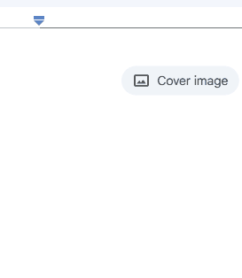

# Mojify


A sleek, modern emoji and emote clipboard manager built with Tauri and Svelte.



## Features

- 🎨 **Modern, glass-like UI**: Beautiful, sleek design inspired by Windows 11
- 🔍 **Instant search**: Quickly find any emoji or emote
- ⌨️ **Global shortcut**: Access emojis from anywhere with `Alt+Space`
- 🌓 **Dark/Light mode**: Switch between themes based on your preference
- 🔄 **System tray integration**: Always accessible from your taskbar
- 📋 **Windows Clipboard-like experience**: Pop up when needed, hide when not in use
- 🚀 **Fast and lightweight**: Built with performance in mind

## Technology Stack

- **[Tauri](https://tauri.app/)**: Lightweight, secure desktop framework
- **[Svelte](https://svelte.dev/)**: Component-based UI framework
- **[Vite](https://vitejs.dev/)**: Modern frontend build tool

## Getting Started

### Prerequisites

- [Node.js](https://nodejs.org/) 18 or higher
- [Rust](https://www.rust-lang.org/tools/install) and Cargo (for Tauri)
- [Tauri CLI](https://tauri.app/v1/guides/getting-started/prerequisites/) - System dependencies for your OS

#### Setting Up Rust and Tauri
1. Install Rust using [rustup](https://rustup.rs/):
   ```bash
   # Windows
   winget install Rustlang.Rustup
   # OR curl method (works on all platforms)
   curl --proto '=https' --tlsv1.2 -sSf https://sh.rustup.rs | sh
   ```

2. Ensure Rust and Cargo are in your PATH (may require terminal restart)

3. Install OS-specific dependencies for Tauri:
   - **Windows**: Microsoft Visual Studio C++ Build Tools (install via [Visual Studio Installer](https://visualstudio.microsoft.com/visual-cpp-build-tools/))
   - **macOS**: Xcode Command Line Tools (`xcode-select --install`)
   - **Linux**: Refer to [Tauri prerequisites](https://tauri.app/v1/guides/getting-started/prerequisites)

### Installation

1. Clone the repository:
   ```bash
   git clone https://github.com/yourusername/mojify.git
   cd mojify
   ```

2. Install frontend dependencies:
   ```bash
   cd frontend
   npm install
   ```

### Running the Application

#### Method 1: Using separate terminal windows
1. Start the frontend development server:
   ```bash
   # Navigate to frontend directory if not already there
   cd frontend
   npm run dev
   ```

2. In a separate terminal, build and run the Tauri application:
   ```bash
   # Navigate to the src-tauri directory from project root
   cd src-tauri
   cargo run
   ```

#### Method 2: Install Tauri CLI and run together
1. Install the Tauri CLI globally:
   ```bash
   npm install -g @tauri-apps/cli
   ```

2. Run from the project root:
   ```bash
   # From the project root
   tauri dev
   ```

### Building for Production

1. Build the frontend first:
   ```bash
   cd frontend
   npm run build
   ```

2. From the project root, build the Tauri application:
   ```bash
   # If you have Tauri CLI installed globally
   tauri build
   
   # OR directly with cargo
   cd src-tauri
   cargo build --release
   ```

The built application will be in the `src-tauri/target/release` directory:
- Windows: Look for `Mojify_x.x.x_x64_en-US.msi` installer
- macOS: `Mojify.app`
- Linux: AppImage, Debian package, or other formats depending on configuration

### Troubleshooting

- If you encounter build errors, ensure all prerequisites are correctly installed
- For Rust-related issues, try `cargo clean` before rebuilding
- Check the [Tauri documentation](https://tauri.app/v1/guides/debugging/application/) for debugging tips
- If you see "Missing script" errors, double-check which directory you're in. Frontend scripts are in the `frontend` directory
- For Windows users: Make sure you're running commands in a shell with administrator privileges when necessary

## Usage

- **Global Shortcut**: Press `Alt+Space` to open Mojify from anywhere
- **System Tray**: Click the Mojify icon in your system tray to show/hide the app
- **Search**: Type to instantly filter emojis
- **Categories**: Browse emojis by category
- **Copy to Clipboard**: Click any emoji to copy it to your clipboard and dismiss the app

## Customization

### Adding Custom Emotes

You can add custom emotes by modifying the emojis data in the Svelte components.

### Changing the Global Shortcut

To change the global shortcut, modify the `register` call in `src-tauri/src/main.rs`:

```rust
app.global_shortcut_manager()
    .register("YOUR_CUSTOM_SHORTCUT", move || {
        // ...
    })
```

## License

This project is licensed under the MIT License - see the LICENSE file for details.

## Acknowledgements

- Inspired by Windows Clipboard and modern UI design principles
- Special thanks to the Tauri and Svelte communities for their excellent documentation

---

Made with ❤️ by [Your Name]
